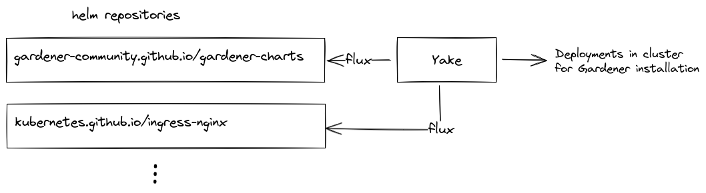
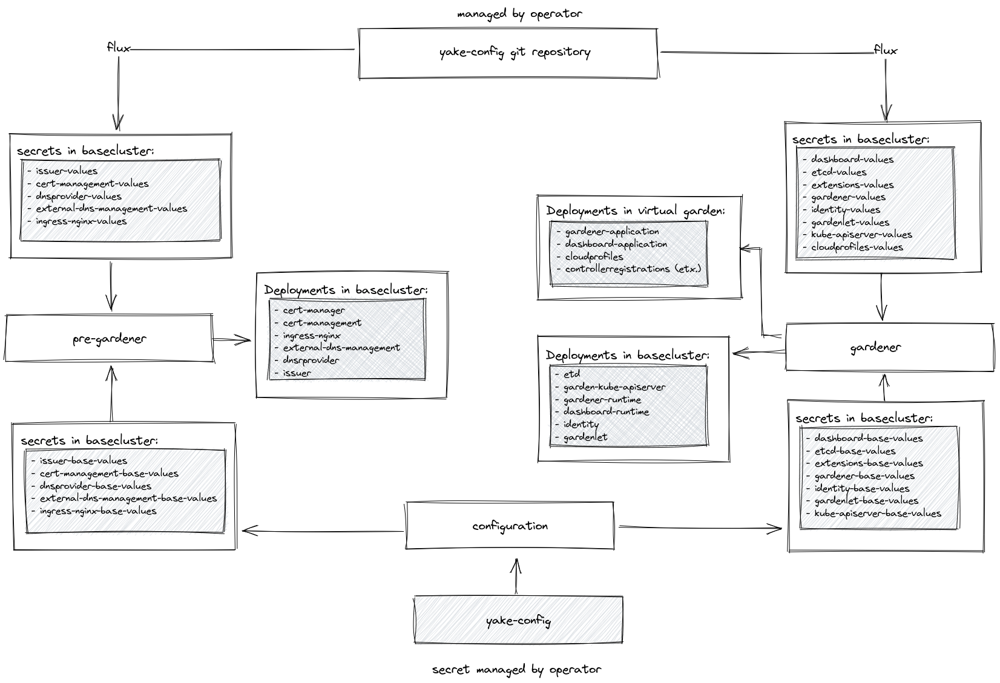

# Architecture

## High Level Overview

Let's start off with the very high level overview in the block diagram above. The most important aspect to note is that all deployments needed for the [Gardener](https://gardener.cloud/) installation are based on helm charts. Since the helm charts developed in the Gardener upstream are distributed over several repositories in the Gardener [Github organization](https://github.com/gardener/external-dns-management), we consolidated the relevant charts in another [repository](https://github.com/gardener-community/gardener-charts) hosted on Github. Consequently, YAKE fetches helm charts from several helm repositories and deploys the components for the Gardener installation into the base cluster.

## Detailed Architecture

A more detailed view of the YAKE architecture is depicted in the block diagram below.

### Main entry points

Conceptually, there are two entry points for Gardener operators to interact with the configuration:

1. The `yake-config` secret in the base cluster
2. The YAKE configuration git repository

The reason for having a dedicated `yake-config` secret lies in the assumption that an operator does not want to store credentials such as dnsprovider credentials in a git repository. Of course, this could also be handled by solutions like [sops](https://github.com/mozilla/sops), but we wanted to let the operator decide where to store the `yake-config` secret in the end.

### General Concepts

As observed from the figure, the YAKE concept divides the installation process into tree separate stages: The `configuration`, `pre-gardener` stage and the `gardener` stage. The configuration stages transfer the content of the `yake-config` secret into separate secrets serving as values for the eventually deployed helm charts. Consequently, the default values given in the upstream values files for the helm charts are extended by the `*-base-values` secrets, so that all components come with a meaningful base configuration. This base configuration is assumed to be homogeneous across many Gardener environments. For the parts which are environment specific, another set of secrets stores another set of values for the helm charts. These secrets are pulled in from the YAKE configuration git repository and managed by a GitOps workflow.

As we assume that the underlying base cluster does not come with any services installed, the `pre-gardener` stage ensures that the required services are deployed to the cluster. In more detail, the following services and resources are deployed:

- [cert-manager](https://cert-manager.io/) for internal certificate handling
- [cert-management](https://github.com/gardener/cert-management) for browser trusted certificate handling
  - An `issuer` resource representing a certificate issuer in the base cluster
- [external-dns-management](https://github.com/gardener/external-dns-management) for creation of DNS entries
  - A `dnsprovider` resource representing a DNS provider such as azure-dns, aws-route53 etc. in the base cluster
- [ingress-nginx](https://kubernetes.github.io/ingress-nginx/) as ingress controller

In the `gardener` stage, the gardener specific components are deployed to the base cluster and to the [virtual garden](https://github.com/gardener/garden-setup#concept-the-virtual-cluster). The most important aspect to note here is that the [gardenlet](https://gardener.cloud/docs/gardener/concepts/gardenlet/) is deployed to the base cluster, i.e. the base cluster also serves as initial seed cluster for the resulting Gardener environment.

### backups

### webterminal
